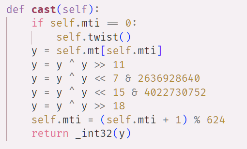

[TOC]

# MT19937 Predictor and Solver

基于项目[https://github.com/JuliaPoo/MT19937-Symbolic-Execution-and-Solver](https://github.com/JuliaPoo/MT19937-Symbolic-Execution-and-Solver)，并做改动与拓展

## MT19937简介

算法内部状态大小为19968bit，以32bit为一个单元进行输出。每输出624个单元后，会进行一次twist。如下图所示：

## 功能

### 已知完整输出序列

即已知连续的624个输出单元的输出内容。即连续的19968bit的输出

较为简单

可以直接在算法层面进行逆向推导

对 cast 进行逆向，实现随机数输出与内部state的转换。

参考这篇blog：[浅析MT19937伪随机数生成算法](https://www.anquanke.com/post/id/205861#h2-2)

### 不完整输出序列

当需要生成的随机数小于32bit时，PRNG会对一个单元的输出进行截断，保留MSB作为输出

若有连续的MSB截断的输出序列，也能实现预测

算法内部的变化，主要是两部分，twist和extract，两个都是线性的变换

可以抽象为:
$$
T*state=R
$$
这里state为19968*1的向量，代表算法内部state

R为同样大小的向量，代表算法的输出

T为变换矩阵，结合了twist和extract两个过程。

则恢复state可以通过以下方式:
$$
state=T^{-1}*R
$$

#### 构造T的方法

这里的T，和随机数序列的输出方式是相关的。比如连续的getrandbits(32)构造的矩阵和连续的getrandbits(16)构造的矩阵，是不一样的

1. 通过就该state的值，一行一行测出来

   随机数生成的序列是已知的，如16bit MSB，则可以修改state的值为`(1,0,0,0,...,0)`，此时与T相乘后，得到的输出R就是T矩阵的第一列。

   以此类推，则可以得到完整的T矩阵的值

2. 通过符号执行

   算法内部运算都是在模2有限域下进行，可以将初始state设为符号 $a_1,a_2,...,a_{19968}$	
   
   使用符号表示的state执行算法内部的过程，输出的每一个bit即为T矩阵的每一行
   

#### 对T求逆

有一点需要注意的是，根据twist过程可以知道，state经过twist之后，第1个bit至第32个bit，这些bit没有参与twist的过程，twist后的结果也与这31个bit无关

这导致通过两种方法构造出的T矩阵，都是不满秩的
