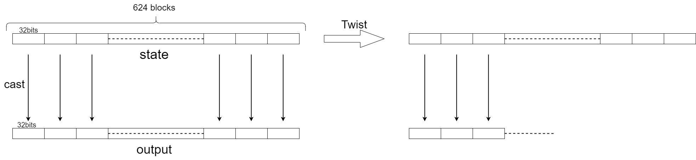
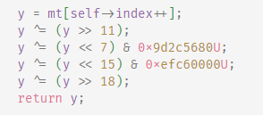

[TOC]


# MT19937 Predictor and Solver

基于项目[https://github.com/JuliaPoo/MT19937-Symbolic-Execution-and-Solver](https://github.com/JuliaPoo/MT19937-Symbolic-Execution-and-Solver)，并做改动与拓展


## MT19937简介

算法内部状态大小为19968bit，以32bit为一个单元进行输出。每输出624个单元后，会进行一次twist。如下图所示：



## 功能

### 已知完整输出序列

即已知连续的624个输出单元的输出内容。即连续的19968bit的输出

较为简单

可以直接在算法层面进行逆向推导



对 tamper 进行逆向，实现随机数输出与内部state的转换。

#### 方法：

参考这篇blog：[浅析MT19937伪随机数生成算法](https://www.anquanke.com/post/id/205861#h2-2)

从下往上逐行分析
```python
y1 = y ^ (y >> 18)
```
这一句对 y 的高18位没有影响，即`y1>>18 == y>>18`，所以可以直接推出 y 的高18位的值，进而得到剩余的低14位的值。

```python
y = y ^ y << 15 & 0xefc60000
```
根据运算符的优先级，可以得到`y1 = y^((y<<15)&4022730752)`，和上一步类似，y1的低15位是y的低15位和mask异或的结果，重复步骤可以得到y的全部信息。

用python表示完整过程的代码：

```python
def untempering(y):
    y ^= (y >> 18)
    y ^= (y << 15) & 0xefc60000
    y ^= ((y <<  7) & 0x9d2c5680) ^ ((y << 14) & 0x94284000) ^ ((y << 21) & 0x14200000) ^ ((y << 28) & 0x10000000)
    y ^= (y >> 11) ^ (y >> 22)
    return y
```


### 不完整输出序列

当需要生成的随机数小于32bit时，PRNG会对一个单元的输出进行截断，保留MSB作为输出。如下图所示，生成的32bit的随机数与16bit的随机数的高位相同。


如果获取的是连续的经过msb截断的数据，也能实现预测。

算法内部主要有两部分，twist和tamper。其中twist是在算法初始化之后或者生成624个随机数之后，对算法内部state进行旋转的操作。tamper是对一个32bit的state单元，进行操作得到32bit的随机数输出。这两个变换都是线性的变换

其中，twist过程等价于state向量与Twist矩阵相乘。这里的state大小位19968*1，Twist矩阵T大小为19968\*19968，如下

$
T_1*state=state'
$

这里的state’代表经过一次旋转的state

tamper过程的对象是32bit的state单元，称为block，则可以有如下关系

$T_2*block=R$

这里的R代表输出是随机数，为32bit

同时，对于整个state，也有如下关系
$\left[\begin{matrix}
T_2 & 0 & 0 & \cdots & 0\\
0 & T_2 & 0 & \cdots & 0\\
0 & 0 & T_2 & \cdots & 0\\
\vdots & \vdots & \vdots & \ddots & \vdots\\
0 & 0 & 0 & \cdots & T_2
\end{matrix}\right]*state=R$

$$
\left[\begin{matrix}
 T_2 & & & & \\
 & T_2 & & & \\
 & & T_2 & & \\
 & & & \ddots & \\
 & & & & T_2
\end{matrix}\right]*state=R
$$

这里的每一个 $T_2$ 都是一个32*32的矩阵，组合起来就是一个19968\*19968大矩阵，记大矩阵为$T_2'$

此时，可以将Twist和Tamper过程联合，可以将整个过程抽象为:
$$
(T_1)^n*T_2'*state=R
$$
这里state为19968*1的向量，代表算法内部state

R为同样大小的向量，代表算法的输出

T为变换矩阵，结合了twist和extract两个过程。

则恢复state可以通过以下方式:
$$
state=T^{-1}*R
$$


#### 构造T的方法

这里的T，和随机数序列的输出方式是相关的。比如连续的getrandbits(32)构造的矩阵和连续的getrandbits(16)构造的矩阵，是不一样的

1. 通过就该state的值，一行一行测出来

   随机数生成的序列是已知的，如16bit MSB，则可以修改state的值为`(1,0,0,0,...,0)`，此时与T相乘后，得到的输出R就是T矩阵的第一列。

   以此类推，则可以得到完整的T矩阵的值

2. 通过符号执行

   算法内部运算都是在模2有限域下进行，可以将初始state设为符号 $a_1,a_2,...,a_{19968}$	
   
   使用符号表示的state执行算法内部的过程，输出的每一个bit即为T矩阵的每一行
   


#### 对T求逆

有一点需要注意的是，根据twist过程可以知道，state经过twist之后，第1个bit至第32个bit，这些bit没有参与twist的过程，twist后的结果也与这31个bit无关

这导致通过两种方法构造出的T矩阵，都是不满秩的
